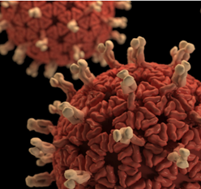
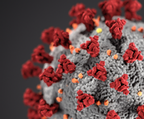

# CSCI-788 Capstone Project
> Use NLP to Answer Key Questions From Scientific Literature

[![NPM Version][npm-image]][npm-url]
[![Build Status][travis-image]][travis-url]
[![Downloads Stats][npm-downloads]][npm-url]

In December 2019, the World Health Organization identified a new coronavirus disease with severe pneumatic symptoms, which they named COVID-19. This paper uses natural language processing to answer questions from the scientific literature that can help the public better understand COVID-19. We explore both unsupervised learning and supervised learning. Medical staff could then more efficiently search for relevant articles, using the clusters that our analysis provides. They could also categorize unsorted articles according to the schema that our models provide. Future research could further develop and confirm associations between scientific articles via sentiment analysis. 

## Table of Contents 
- How to read papers in the database
- Baseline of this project
- The implementation of LDA algorithm
- The implementation of GMM algorithm
- Learning curve with TF-IDF feature extraction
- Learning curve with LDA transform feature extraction
- The implementation of BERT algorithm
- How to test performance

## Usage example

This project is based on python environment, and the coding can be implemented via any python-related IDE.

## How to run the program
- Change the path which is in line 65 to your local path to read the dataset
- Be sure to download pdf_json.zip file which is the pdf format of the Kaggle dataset
- Download corpus_matrix.npy, body_all_text.npy, and word_feature_list.npy files and put them in the same path as the dataset
- Run the program in python IDE

## Release History

* How to read papers in the database[read_articles.py]
    * All the papers are stored in JSON format, we operate the JSON files to get the content of the paper. 
    * Label data, 'Y' if English and paper is population study and 'N' if not English or not a population study related
    * Train an SVM regressor with TF-IDF bag of words features over full text of each paper on labeled data
    * Run trained SVM on full data set. It should output a number for each paper between -1 and 1
    * Sample 67 papers from top 10% of SVM ooutputs, 67 from bottom 10%, and 66 from middle 10%
    * Repeat the process
* Baseline of this project[csci788_capstone.py]
    * Data cleaning
    * TF-IDF feature extraction
    * Keywords word cloud visualization, how many documents contain keywords, create word cloud of all keywords
    * Keywords histogram visualization, how many documents total
    * Test the performance of all 3000 papers training dataset
* The implementation of LDA algorithm[lda_implementation.py]
    * Log likelihood score visualization from grid search output
    * Create topic matrix document
    * Create topic keyword document
    * Create LDA html format visualization
    * Show top n keywords for each topic
    * Plot 10 most common words
* The implementation of GMM algorithm[GMM_implementation.py]
    * Using GMM unsupervised learning algorithm to plot 15 different clusters of the word cloud
    * Make word clouds black and white (rather than color)
    * Provide a table for the top words in each GMM cluster
* Learning curve with TF-IDF feature extraction[lc_gridsearch.py]
    * Consider bigrams, trigrams as features (in addition to unigrams)
    * For all of the learning/ROC curves, train on 2500 items only, test with 500 development items and ignore 200 test items
    * Set class according to % of positives, try class_weight attribute in the scikit-learn grid search object
    * Try grid search on training set
    * Finish learning curve for SVM, start with 200 items from training set, add 230 more items at each iteration (10 points/model total)
* Learning curve with LDA transform feature extraction[lda_transform.py]
    * Perform LDA (Latent Dirichlet Allocation) on training data, try 20-100 topics
    * Measure BIC (baysian information criterion), score, and perplexity for each (step by 5 or 10 topics at a time)
    * Graph each score for each model
    * Using top 1500 unigrams, bigrams, trigrams features and using the transform function in the LDA scikit-learn module to get the projections of LDA models with best perplexity and score
* The implementation of BERT algorithm[bert_implementation.py]
    * The initial exploration of the BERT embedding algorithm
* How to test performance[svm_test_validation.py]
    * Construct test validation, pull a random set of data (200 items) not from training set
    * Label it manaully
    * Run previous trained model on this dataset
    * If test results are good: run predictive model on all data, so we'll have a set of all population study papers
    * We now 2500/500/200 (training/dev/test) split

## Meta

Zhuo Liu  – zl9901@rit.edu

Rochester Institute of Technology

## Contributing

1. Fork it (<https://github.com/yourname/yourproject/fork>)
2. Create your feature branch (`git checkout -b feature/fooBar`)
3. Commit your changes (`git commit -am 'Add some fooBar'`)
4. Push to the branch (`git push origin feature/fooBar`)
5. Create a new Pull Request

<!-- Markdown link & img dfn's -->
[npm-image]: https://img.shields.io/npm/v/datadog-metrics.svg?style=flat-square
[npm-url]: https://npmjs.org/package/datadog-metrics
[npm-downloads]: https://img.shields.io/npm/dm/datadog-metrics.svg?style=flat-square
[travis-image]: https://img.shields.io/travis/dbader/node-datadog-metrics/master.svg?style=flat-square
[travis-url]: https://travis-ci.org/dbader/node-datadog-metrics
[wiki]: https://github.com/yourname/yourproject/wiki
